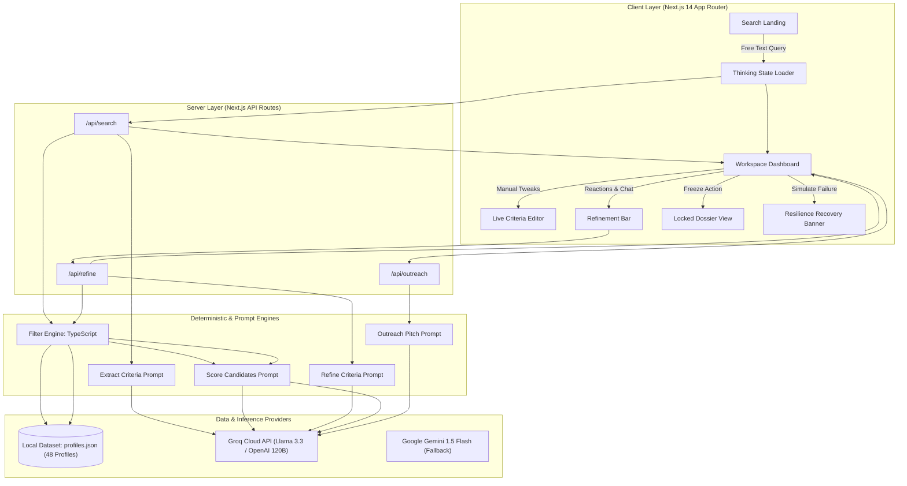
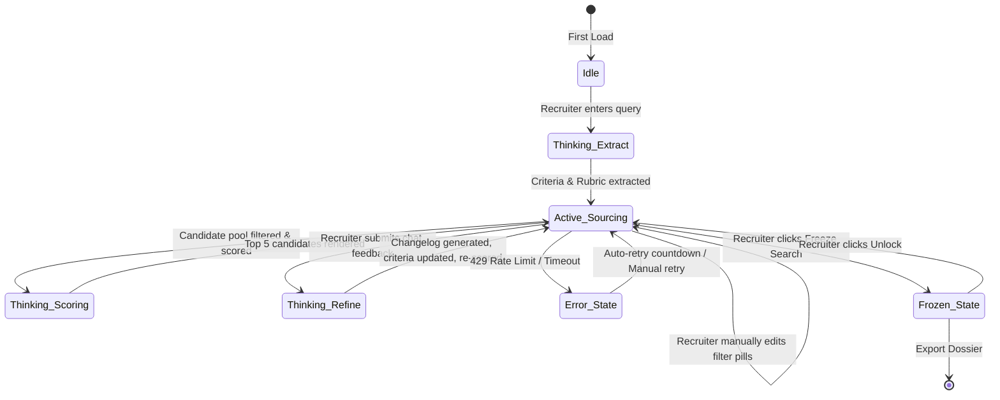

# System Architecture & Technical Specification
## AI Recruiter: The Sourcing Refinement Loop
**Author:** Devansh Bhargava  
**Target System:** Flexiple AI Recruiter Platform  

---

## 1. High-Level System Architecture

The application is structured as a **hybrid deterministic filtering and LLM evaluation engine**. Instead of relying on a naive end-to-end LLM approach (which suffers from latency, token cost, hallucinations, and context length limits), the architecture decouples hard structural constraints from qualitative rubric evaluations.



---

## 2. Core Architectural Pillars

### 2.1 The 2-Tier Filtering & Scoring Pipeline
1. **Tier 1: Deterministic Hard Filter (`src/lib/filterEngine.ts`)**:
   - Evaluates non-negotiable objective bounds:
     - Experience Range: $Years_{min} \le Exp \le Years_{max}$
     - Location Match: Case-insensitive substring matching against candidate location (with Remote allowances).
     - Company Background: Verifies whether candidate’s current or any past company matches target types (`startup`, `scaleup`, `enterprise`, `agency`).
     - Core Skill Coverage: Ensures presence of required primary skills in candidate skill sets or summary.
   - **Performance**: Runs locally in $<2\text{ms}$ over the candidate pool.
2. **Tier 2: Qualitative Rubric Scoring with Exact Citations (`src/lib/prompts/scoreCandidates.ts`)**:
   - Only pre-ranked candidates passing Tier 1 reach the LLM.
   - The LLM evaluates candidates against the **Fit Rubric** on a scale of 0 to 100.
   - **Citation Mandate**: Every evaluation must explicitly extract and quote exact profile fields (`skills`, `current_company`, `summary`, `years_experience`), eliminating generic recruiter praise.

---

## 3. The Conversational Refinement Loop State Machine



---

## 4. Resilience & Graceful Error Recovery

1. **Timeout Guard**: Every LLM call is wrapped in a 15,000ms `Promise.race` rejection handler to prevent hanging connections.
2. **Malformed JSON Recovery**: The `cleanAndParseJSON` utility extracts outermost braces/brackets and strips markdown code fences (` ```json `), preventing parsing crashes when models return conversational prefixes.
3. **Interactive Failure Simulator**: Built-in header menu allowing live demonstration of 429 Rate Limits, Schema Validation Errors, and Timeout Recovery without breaking application state.

---

## 5. Scaling to Flexiple's 98M Talent Map

While this challenge runs against 48 local profiles, the architecture is designed to scale horizontally to millions of candidates:

```
[ Natural Language Query ]
            │
            ▼
[ LLM Criteria Extraction: Hard Filters + Latent Embeddings ]
            │
    ┌───────┴──────────────────────────┐
    ▼                                  ▼
[ Structural DB Index ]     [ Vector Search Engine ]
(PostgreSQL / ClickHouse)    (Pinecone / Milvus / pgvector)
Filter: Years, Location,    Semantic Match: Summary, Archetype
Company Type                Embeddings
    │                                  │
    └───────┬──────────────────────────┘
            ▼
[ Candidate Intersection & Top 50 Retrieval ]
            │
            ▼
[ Cross-Encoder Re-ranker / LLM Scoring with Citations ]
            │
            ▼
[ Top 5 Recruiter View ]
```
